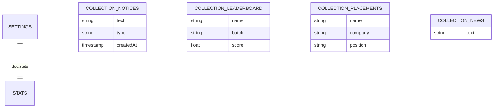

# CPI CST Dashboard - Database Schema (ER Diagram)

This document describes the Firestore collection structure and field types used in the application.

## 1. Collections & Documents

### `notices` (Collection)
Stores departmental announcements.
| Field | Type | Description |
|-------|------|-------------|
| `text` | String | The content of the notice |
| `type` | String | 'info' or 'warning' |
| `createdAt` | Timestamp | Server-side timestamp |

### `news` (Collection)
Scrolling ticker news items.
| Field | Type | Description |
|-------|------|-------------|
| `text` | String | News headline |
| `createdAt` | Timestamp | Server-side timestamp |

### `leaderboard` (Collection)
Top performing students.
| Field | Type | Description |
|-------|------|-------------|
| `name` | String | Student's full name |
| `batch` | String | Class/Year batch |
| `score` | Number | GPA or custom score |
| `avatar` | String | Emoji or URL |
| `createdAt` | Timestamp | Server-side timestamp |

### `placements` (Collection)
Job success records.
| Field | Type | Description |
|-------|------|-------------|
| `name` | String | Student name |
| `company` | String | Hired company |
| `position` | String | Job title |
| `year` | String | Batch year |

### `projects` (Collection)
Innovation hub projects.
| Field | Type | Description |
|-------|------|-------------|
| `title` | String | Project name |
| `team` | String | Responsible team |
| `status` | String | Development state |

### `settings` (Collection)
System-wide configuration.
- **Document ID: `stats`**
| Field | Type | Description |
|-------|------|-------------|
| `totalStudents` | Number | Global count |
| `activeStudents` | Number | Currently on campus |
| `alumni` | Number | Graduated students |
| `performanceIndex` | Number | Average GPA |
| `placementRate` | Number | Percentage (0-100) |

## 2. Visual Representation (Mermaid)

